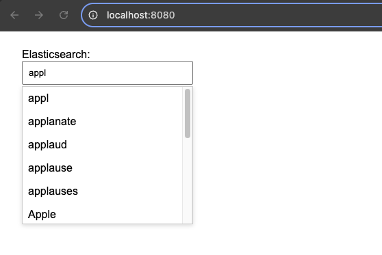
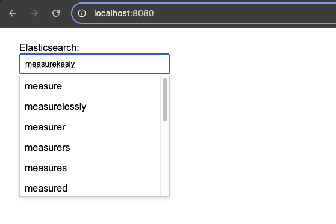

# hsa13-hw10-nosql-databases-elasticsearch
Create ES index that will serve autocomplete needs with leveraging typos and errors (max 3 typos if word length is bigger than 7). Please use english voc. Ang look at google as a ref.

## Issue with Running Elasticsearch Locally on Mac

Initially, I planned to run Elasticsearch locally using Docker on my **Mac M4 Pro (ARM64)**. However, I ran into compatibility issues that prevented it from starting properly. Instead of spending time debugging, I opted for **Elastic Cloud**, which provided a hassle-free setup and allowed me to focus on implementing the solution rather than troubleshooting infrastructure problems.

### References
- [GitHub Issue: Corretto 21 - ARM64 Problems](https://github.com/corretto/corretto-21/issues/85)

### Instructions for Running the Application Locally

If you want to run the application locally, you can download the image and start the container using the following commands:
```sh
docker pull marynakovalova/hsa13-hw10-nosql-databases-elasticsearch-app:latest
docker run -p 8080:8080 marynakovalova/hsa13-hw10-nosql-databases-elasticsearch-app:latest
```
The web interface will be available at `http://localhost:8080/`.

### Screenshots



### Description

The solution leverages Elasticsearch to provide autocomplete functionality while handling typos and spelling mistakes. The key components are:

- **Indexing Strategy**: The index is built using an English vocabulary stored in a text file and loaded into Elasticsearch during application startup.
- **Custom Analyzer**: A dedicated `autocomplete_analyzer` is used, which combines `lowercase` and `edgeNgram` filters to enable partial matching.
- **Search Logic**: The query uses a combination of `match` and fuzzy search:
  - If the input length is **7 characters or less**, Elasticsearch automatically determines the fuzziness level.
  - If the input is **longer than 7 characters**, a `minimum_should_match` threshold of **75%** ensures better relevance.


